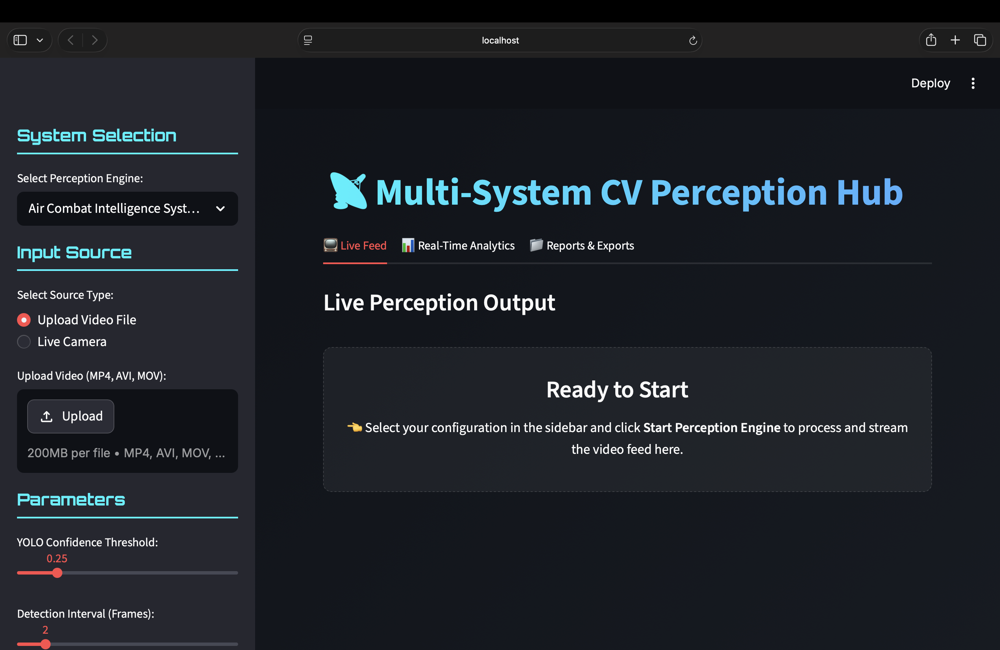

# Computer Vision Projects

## Dev/Creator = alwaysprince05



Research & Educational Purposes Only.

---

# 1. Air Combat Intelligence System

A military-style computer vision platform for tracking aircraft, predicting flight paths, analyzing airspace activity, and generating tactical intelligence from aerial footage.

### Features

* Aircraft Detection
* Multi-Object Tracking
* Flight Path Prediction
* Threat Analysis
* Airspace Monitoring
* Trajectory Visualization
* Tactical Dashboard
* Airspace Heatmaps
* Digital Twin Airspace View

### Relevant Resources

Wikipedia:

https://en.wikipedia.org/wiki/Air_combat

https://en.wikipedia.org/wiki/Fighter_aircraft

https://en.wikipedia.org/wiki/Military_aircraft

https://en.wikipedia.org/wiki/Object_detection

https://en.wikipedia.org/wiki/Object_tracking

https://en.wikipedia.org/wiki/Computer_vision

https://en.wikipedia.org/wiki/Radar

---

# 2. License Plate Intelligence System

A computer vision system for vehicle detection, automatic number plate recognition, vehicle tracking, and traffic intelligence analytics.

### Features

* Vehicle Detection
* License Plate Detection
* OCR Recognition
* Vehicle Tracking
* Traffic Analytics
* Confidence Scoring
* Dashboard Visualization
* CSV Export
* Real-Time Monitoring

### Relevant Resources

Wikipedia:

https://en.wikipedia.org/wiki/Automatic_number-plate_recognition

https://en.wikipedia.org/wiki/Optical_character_recognition

https://en.wikipedia.org/wiki/Vehicle_registration_plate

https://en.wikipedia.org/wiki/Object_detection

https://en.wikipedia.org/wiki/Computer_vision

---

# 3. Airport Runway Intelligence System

An aviation analytics platform for monitoring aircraft movement, runway utilization, airport traffic, and operational activity.

### Features

* Aircraft Detection
* Aircraft Tracking
* Runway Occupancy Analysis
* Takeoff Detection
* Landing Detection
* Taxiway Monitoring
* Airport Traffic Analytics
* Flight Path Visualization
* Airport Operations Dashboard

### Relevant Resources

Wikipedia:

https://en.wikipedia.org/wiki/Airport

https://en.wikipedia.org/wiki/Runway

https://en.wikipedia.org/wiki/Air_traffic_control

https://en.wikipedia.org/wiki/Aircraft

https://en.wikipedia.org/wiki/Object_tracking

https://en.wikipedia.org/wiki/Computer_vision

---

# Technologies Used

* Python
* OpenCV
* YOLO
* NumPy
* Pandas
* SciPy
* Matplotlib
* Pillow

---

# How To Fork

Clone the repository:

```bash
git clone https://github.com/alwaysprince05/computervision_projects.git
```

Move into the project directory:

```bash
cd computervision_projects
```

Run:

```bash
python main.py
```

Each project automatically installs required dependencies on first launch.

---

# License

MIT License

---

Built by **alwaysprince05**
